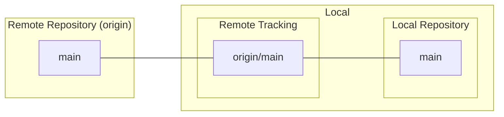
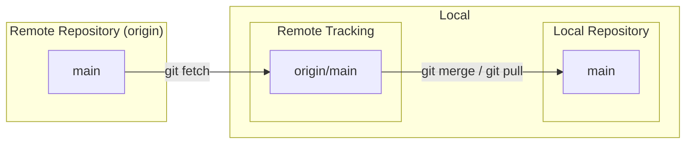
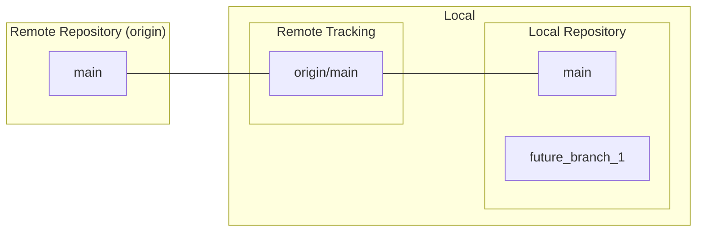
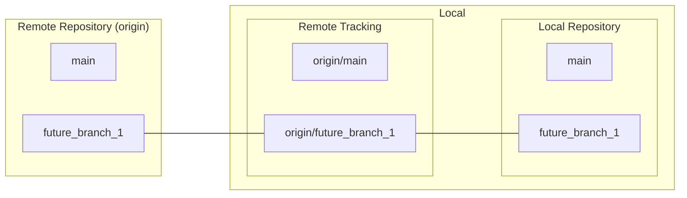
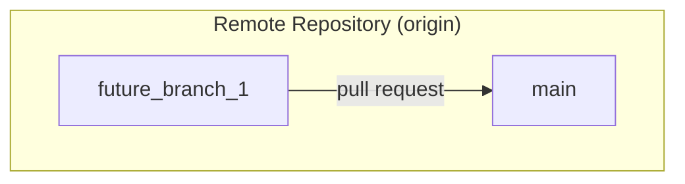

# gitでのリモートとローカルのやりとりを図にしてみた
## 機能ブランチの元となるブランチの最新を取得
### 新たにクローンする

```bash
git clone -b <ブランチ名> <リポジトリのURL> <保存先フォルダ名>
```


### 既にローカルに存在するレポジトリを最新の状態に追従する
```bash
git fetch
git merge
or
git pull
```



## 機能ブランチをローカルに作成
```bash
git switch -c <機能ブランチ名>
```



+ ローカルにブランチを作成しただけで、リモート側はなにも変更していない
  + つまり、新しく作成した機能ブランチは、リモート追跡と紐づいていない

## ローカル機能ブランチでの修正をコミット＆プッシュ



## GitHub上で機能ブランチから上流ブランチにプルリクエスト

